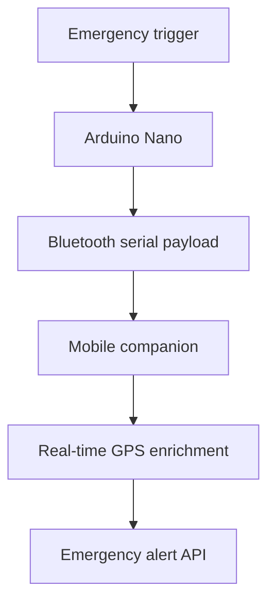

# Froz-Kit

**Embedded Emergency IoT System**

Froz-Kit is an award-winning hardware-software emergency system developed during the Engineering Challenges course at Pontificia Universidad Católica de Chile. The project placed **2nd out of 103 engineering teams**.

## Overview

The system was designed around an endothermic limb-preservation chamber and an emergency alert workflow. An Arduino Nano detects the emergency trigger, sends a compact Bluetooth payload to a mobile companion, and the mobile pipeline enriches the event with real-time GPS coordinates before dispatching an automated API alert.

## Key Contributions

- Engineered C/C++ firmware on Arduino Nano using interrupt-driven logic for sub-second emergency-trigger execution.
- Designed Bluetooth serial communication between the embedded device and mobile companion.
- Built a mobile processing pipeline that appends live GPS coordinates to incoming device payloads.
- Integrated automated API alerts for emergency-service workflows.
- Connected the sensing, communications, mobile, and physical preservation components into an end-to-end prototype.

## System Architecture

## Technology

- **Embedded:** Arduino Nano, C/C++, interrupt-driven firmware
- **Connectivity:** Bluetooth serial communication
- **Mobile pipeline:** Payload ingestion and GPS enrichment
- **Integration:** REST API alert dispatch
- **Domain:** Emergency response and IoT systems

## Recognition

**2nd Place — Engineering Challenges at UC Chile**

Selected among 103 first-year engineering teams in one of Chile's most prestigious engineering solutions competitions.

## Repository Status

This repository is the public documentation release of Froz-Kit. The original firmware, wiring notes, and mobile implementation are currently being organized for a complete source release.
