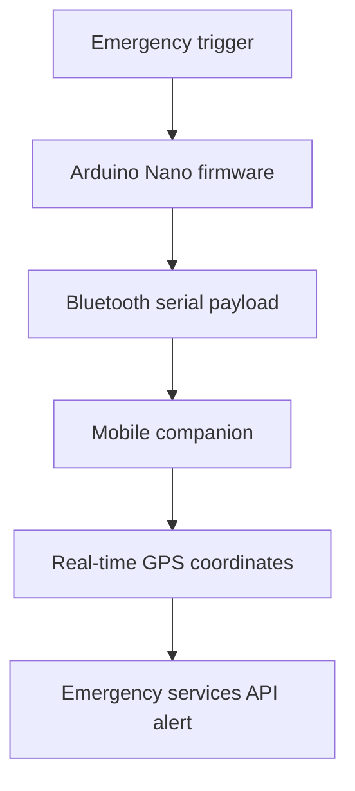

# Froz-Kit

**Embedded Emergency IoT System**

Froz-Kit was developed during the Engineering Challenges course at Pontificia Universidad Católica de Chile and placed **2nd out of 103 engineering teams**.

## Overview

The project combined an endothermic limb-preservation chamber with an emergency alert workflow. C/C++ firmware on an Arduino Nano used interrupt-driven logic to trigger sub-second emergency alerts. A mobile companion ingested Bluetooth serial payloads, appended real-time GPS coordinates, and dispatched automated API alerts to emergency services.

## Key Contributions

- Engineered C/C++ firmware on Arduino Nano using interrupt-driven logic for sub-second execution.
- Developed a mobile companion pipeline for Bluetooth serial payload ingestion.
- Appended real-time GPS coordinates to emergency events.
- Dispatched automated API alerts to emergency services.
- Designed the end-to-end hardware-software integration for the preservation chamber.

## System Architecture

## Technology

- **Firmware:** C/C++ and Arduino Nano
- **Execution:** Interrupt-driven logic
- **Connectivity:** Bluetooth serial communication
- **Mobile pipeline:** Payload ingestion and GPS enrichment
- **Integration:** Automated API alerts
- **Domain:** Embedded systems and IoT

## Recognition

**2nd Place — Engineering Challenges at UC Chile**

The project placed 2nd among 103 engineering teams in Chile's most prestigious engineering solutions competition for first-year students.

## Repository Status

This repository currently presents the project's verified architecture and results. The original firmware and mobile implementation are being organized for a complete source release.
