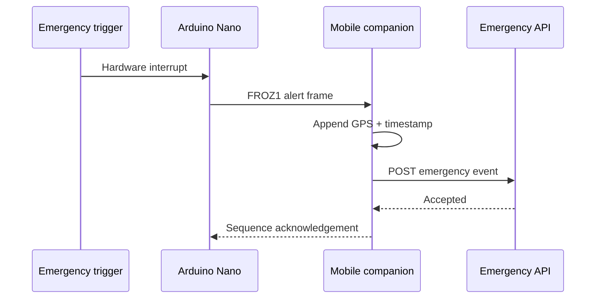

# Froz-Kit

**Embedded emergency IoT system for an endothermic limb-preservation chamber.**

Froz-Kit was developed during the Engineering Challenges course at Pontificia Universidad Católica de Chile and placed **2nd out of 103 engineering teams**.

This repository reconstructs the documented hardware-to-alert workflow: an interrupt-driven Arduino Nano detects the emergency trigger, sends a compact Bluetooth serial frame, and a companion pipeline enriches the event with GPS before dispatching it to an emergency API.

## End-to-end flow



## Firmware

- Minimal interrupt service routine captures the trigger without blocking
- Main-loop debounce and state machine keep serial processing responsive
- Newline-delimited protocol avoids dynamic JSON allocation on the Nano
- Sequence acknowledgements and bounded retries detect delivery failures
- Hardware pins and timing values live in `firmware/include/Config.h`

Build with PlatformIO:

```bash
pio run
pio device monitor
```

The default pin map is a documented reference configuration and should be changed to match the physical prototype before flashing.

The current `nanoatmega328` build is verified with PlatformIO. It uses 6,376 bytes of flash (20.8% of 30 KB) and 350 bytes of SRAM (17.1% of 2 KB), leaving headroom for hardware-specific integration.

## Companion pipeline

The JavaScript companion core is separated from any specific mobile Bluetooth or GPS library. A native app supplies four adapters: serial input/output, location, network fetch, and the emergency API endpoint.

```bash
npm test
npm run simulate
```

The simulator shows the full sequence without contacting a real emergency service.

## Repository structure

```text
firmware/include/Config.h             Hardware and timing configuration
firmware/include/EmergencyProtocol.h  Nano-safe serial framing
firmware/src/main.cpp                 Interrupt and retry state machine
companion/protocol.js                 Streaming Bluetooth frame parser
companion/pipeline.js                 GPS enrichment and API dispatch
companion/simulator.js                Safe end-to-end simulation
test/                                 Protocol and pipeline tests
docs/protocol.md                      Wire protocol specification
```

## Recognition

**2nd Place — Engineering Challenges at UC Chile**

The project placed 2nd among 103 engineering teams in Chile's most prestigious engineering solutions competition for first-year students.

## Safety and scope

This portfolio reconstruction demonstrates the embedded and software architecture. The included endpoint is a simulator value, not a live emergency service. Production use would require validated hardware, authenticated endpoints, platform-specific permissions, regulatory review, and supervised field testing.
